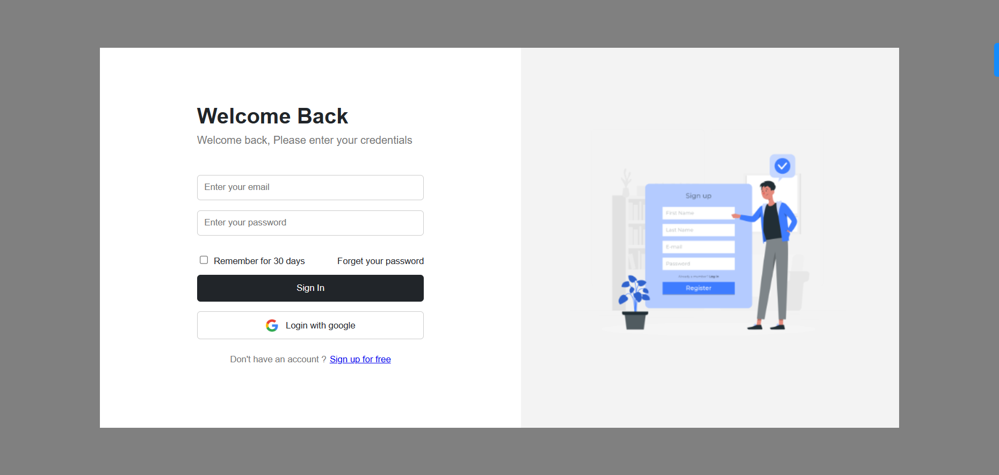
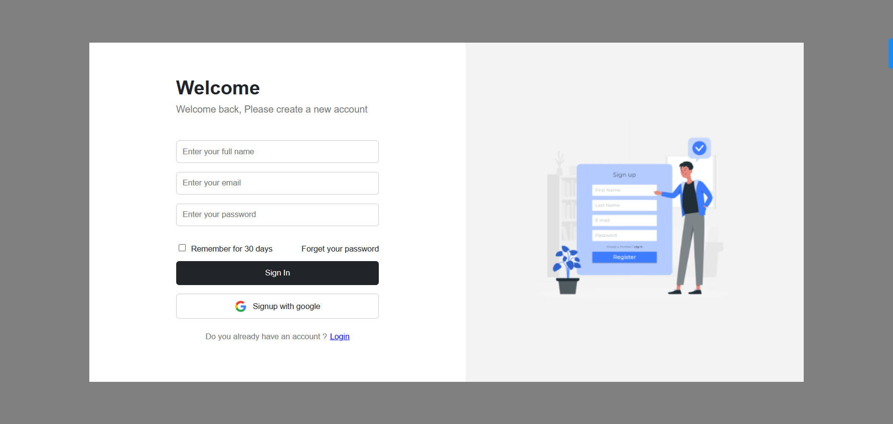
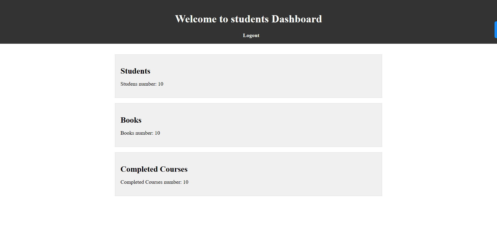

# auth-page

This page is a simple authentication page with a login and register form. It is made with HTML, CSS and JavaScript.

## Live Demo
To view the live demo of the app [click here](https://auth-page-challenge.vercel.app/)

## Demo Login
To login with a demo account use the following credentials:
```
email: mwafrika@gmail.com
password: 123456
```

## Registration
To register a new account, click on the register link and fill in the form. The password must be at least 3 characters long, The name must have at least 6 characters long and the email must have a valid format. On successful registration, you will be redirected to the login page.



## Dashboard
After logging in, you will be redirected to the dashboard page. The dashboard page is a simple page with a welcome message and a logout button. 

